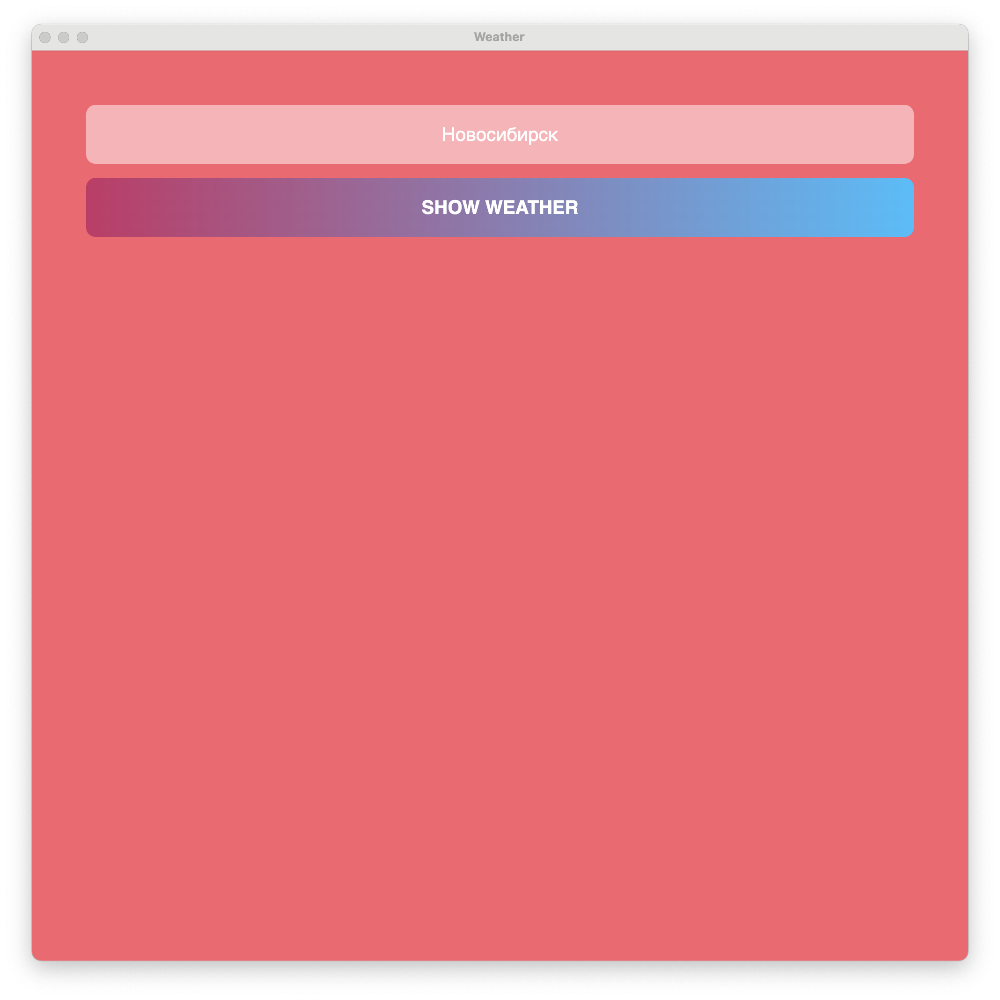
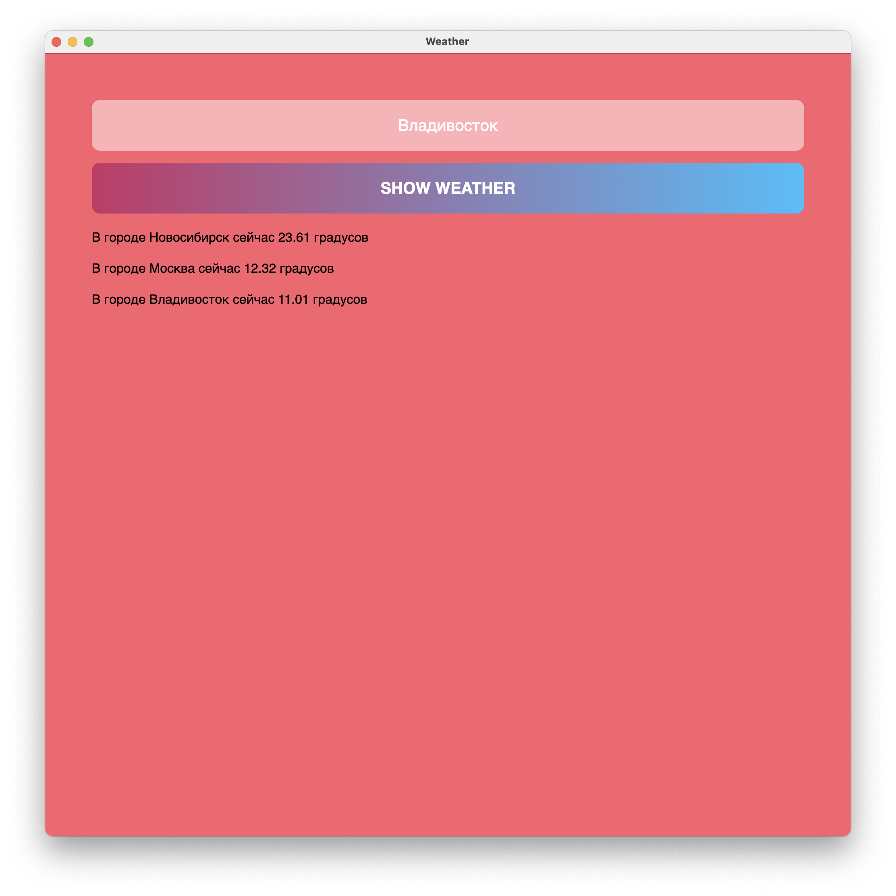

# WeatherPy

Программа для проверки температуры в городе.

После сборки появляется html-страничка, которая представляет собой окно ввода города и кнопка, после которой отправляется на экран текст результата.

Данные берутся с `OpenWeatherMap`. Вывод формируется в виде **Таблицы**, которая запоминает каждый предыдущий вывод.

